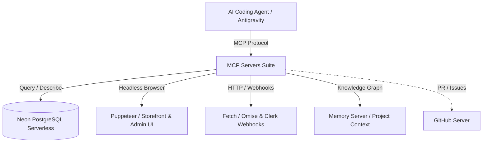

# 📘 คู่มือและรายละเอียด MCP Servers — South Aero Parts Platform

เอกสารนี้อธิบายรายละเอียด สถาปัตยกรรม หน้าที่การทำงาน เครื่องมือ (Tools) และกรณีการใช้งานจริง (Use Cases) ของ **MCP (Model Context Protocol) Servers** ทั้งหมดที่ติดตั้งและกำหนดค่าไว้ในโปรเจกต์ **South Aero Parts**

---

## 📑 สารบัญ
1. [ภาพรวมระบบ MCP Architecture](#1-ภาพรวมระบบ-mcp-architecture)
2. [ตารางสรุป MCP Servers (Quick Matrix)](#2-ตารางสรุป-mcp-servers-quick-matrix)
3. [รายละเอียดเชิงลึกของ MCP แต่ละตัว](#3-รายละเอียดเชิงลึกของ-mcp-แต่ละตัว)
   - [3.1 `neon-postgres` — Database & Schema Engine](#31-neon-postgres--database--schema-engine)
   - [3.2 `puppeteer` — Browser Automation & E2E Testing](#32-puppeteer--browser-automation--e2e-testing)
   - [3.3 `fetch` — API & Webhook Testing](#33-fetch--api--webhook-testing)
   - [3.4 `memory` — Persistent Knowledge Graph & Architectural Context](#34-memory--persistent-knowledge-graph--architectural-context)
   - [3.5 `github` (Optional) — Git & Repository Workflow](#35-github-optional--git--repository-workflow)
4. [ตำแหน่งไฟล์การตั้งค่า (Config Paths)](#4-ตำแหน่งไฟล์การตั้งค่า-config-paths)
5. [แนวทางปฏิบัติด้านความปลอดภัยและประสิทธิภาพ (Best Practices)](#5-แนวทางปฏิบัติด้านความปลอดภัยและประสิทธิภาพ-best-practices)

---

## 1. ภาพรวมระบบ MCP Architecture

**Model Context Protocol (MCP)** เป็นมาตรฐานเปิดที่ช่วยให้ AI Coding Agent เชื่อมต่อกับเครื่องมือภายนอก ฐานข้อมูลจริง เบราว์เซอร์ และ API ได้โดยตรง ทำให้ AI ไม่ได้แค่ "เดาจากโค้ด" แต่สามารถ **ตรวจสอบ (Inspect)**, **ทดสอบ (Test)** และ **ยืนยันผลลัพธ์ (Verify)** ได้ในสภาพแวดล้อมจริง

---

## 2. ตารางสรุป MCP Servers (Quick Matrix)

| Server Identifier | Package / Source | หน้าที่หลัก | แหล่งข้อมูล / เป้าหมาย | ความสำคัญ |
| :--- | :--- | :--- | :--- | :---: |
| **`neon-postgres`** | `@modelcontextprotocol/server-postgres` | ตรวจสอบ Schema, รัน Query ตรวจสอบข้อมูล, Validate Drizzle Migration | Neon Postgres DB (Tables: `products`, `orders`, `users`, `admin_users`, ฯลฯ) | ⭐⭐⭐⭐⭐ |
| **`puppeteer`** | `@modelcontextprotocol/server-puppeteer` | E2E Testing, Visual Audit, ตรวจสอบ Responsive และ Console Errors | `apps/storefront` (Port 3000) & `apps/admin` (Port 3001) | ⭐⭐⭐⭐⭐ |
| **`fetch`** | `@modelcontextprotocol/server-fetch` | ยิงทดสอบ Webhook Payload, ตรวจสอบ Route Handlers และ Streaming API | Omise Payment Webhooks, Clerk Webhooks, PDF Route Handlers | ⭐⭐⭐⭐ |
| **`memory`** | `@modelcontextprotocol/server-memory` | จดจำ Context สถาปัตยกรรม, กฎทางธุรกิจ และประวัติการแก้บั๊ก | Project Knowledge Graph (Session-persistent) | ⭐⭐⭐⭐ |
| **`github`** (เสริม) | `@modelcontextprotocol/server-github` | จัดการ PR, Issues, ตรวจสอบ Commit History ข้ามสาขา | GitHub Repository | ⭐⭐⭐ |

---

## 3. รายละเอียดเชิงลึกของ MCP แต่ละตัว

---

### 3.1 `neon-postgres` — Database & Schema Engine

* **Package:** `@modelcontextprotocol/server-postgres`
* **การเชื่อมต่อ:** เชื่อมต่อกับ Neon PostgreSQL Serverless ผ่าน Connection Pooler URL จาก `.env`

#### 🛠️ ชุดคำสั่ง / Tools ที่มีให้ใช้งาน
1. **`query`**: รันคำสั่ง SQL อ่านข้อมูล (`SELECT`) หรือวิเคราะห์ข้อมูลในตาราง
2. **`list_tables`**: แสดงรายชื่อตารางทั้งหมดในฐานข้อมูล
3. **`describe_table`**: ดูโครงสร้างคอลัมน์, Data Types, Nullability, Primary Keys, และ Foreign Key Constraints

#### 🎯 หน้าที่และ Use Cases ใน South Aero Parts
1. **ตรวจสอบความสัมพันธ์ของ Schema (`packages/db`)**:
   - ตรวจสอบตารางที่ซับซ้อน เช่น `product_compatibility` (Make/Model/Year), `order_status_history`, และ `admin_audit_logs`
   - ตรวจสอบว่าหลังจากรัน `pnpm --filter @repo/db drizzle-kit push` แล้ว ตารางในฐานข้อมูลตรงกับ Schema ในโค้ด TypeScript หรือไม่
2. **ตรวจสอบข้อมูลจำลอง (Seed Data Verification)**:
   - ตรวจสอบว่าสินค้ามีหมวดหมู่ (`categories`) และแบรนด์ (`brands`) ผูกไว้อย่างถูกต้อง
   - ตรวจสอบสถานะคำสั่งซื้อ (`orders.status`, `orders.paymentStatus`) หลังจากจำลองการชำระเงิน
3. **ตรวจสอบความถูกต้องของการแยกประเภทผู้ใช้ (Architecture Rule #2)**:
   - ยืนยันว่าตาราง `users` (Clerk Customer) และ `admin_users` (Self-hosted Admin) แยกกันโดยสมบูรณ์

> 💡 **ตัวอย่าง Prompt ที่สั่ง AI ได้:**
> * *"ช่วย query ดูรายการสินค้า 5 รายการแรกในฐานข้อมูล พร้อมดูว่ามีรูปภาพใน product_images กี่รูป"*
> * *"ช่วย describe โครงสร้างตาราง orders และ order_items ใน Neon DB ให้หน่อย"*

---

### 3.2 `puppeteer` — Browser Automation & E2E Testing

* **Package:** `@modelcontextprotocol/server-puppeteer`
* **การทำงาน:** ควบคุม Headless Chromium เพื่อเข้าชมหน้าเว็บ ทำการคลิก พิมพ์ข้อมูล ตรวจจับ DOM และถ่ายภาพหน้าจอ

#### 🛠️ ชุดคำสั่ง / Tools ที่มีให้ใช้งาน
1. **`puppeteer_navigate`**: นำทางไปยัง URL (เช่น `http://localhost:3000` หรือ `http://localhost:3001`)
2. **`puppeteer_screenshot`**: บันทึกภาพหน้าจอเพื่อตรวจสอบความถูกต้องของ UI
3. **`puppeteer_click`**: จำลองการคลิกปุ่ม ลิงก์ หรือเมนู
4. **`puppeteer_fill`**: พิมพ์ข้อมูลลงในช่องฟอร์ม เช่น Search Input หรือ Login Form
5. **`puppeteer_evaluate`**: รัน JavaScript ใน Context ของหน้าเว็บเพื่ออ่าน Console Log หรือค่าใน LocalStorage

#### 🎯 หน้าที่และ Use Cases ใน South Aero Parts
1. **ทดสอบ User Flow ฝั่ง `apps/storefront`**:
   - ทดสอบ Flow การค้นหาอะไหล่รถยนต์ -> กรองตามรุ่น/ปี -> กดเพิ่มลงตะกร้า (Cart) -> ไปหน้า Checkout
   - ตรวจสอบการทำงานของ Wishlist Action และการกดบันทึกสินค้าที่สนใจ (`user_interests`)
2. **ทดสอบ Dashboard และ Data Grid ฝั่ง `apps/admin`**:
   - ทดสอบการเข้าสู่ระบบ Self-hosted Admin Login ด้วย Password + MFA
   - ตรวจสอบการทำงานของ `@tanstack/react-table` (Server-driven pagination & sorting)
   - ตรวจสอบการเปิดฟอร์ม Setup Wizard และ Growth Simulator Action Plan
3. **Visual & Responsive Design Auditing**:
   - ตรวจสอบว่าหน้าเว็บบน Mobile (Viewport 375px) และ Desktop (1440px) ไม่เกิด Layout Shift หรือ Overflow
4. **ดักจับ Hydration & Console Errors**:
   - ตรวจสอบว่าไม่มี Warning เกี่ยวกับ `Text content did not match server-rendered HTML` ใน Next.js

> 💡 **ตัวอย่าง Prompt ที่สั่ง AI ได้:**
> * *"ช่วยเปิดหน้า http://localhost:3000/products แล้วแคปภาพหน้าจอมาให้ดูหน่อยว่าสินค้าแสดงครบไหม"*
> * *"ช่วยทดสอบกดปุ่มในหน้า Admin Dashboard และเช็คว่ามี Console Error สีแดงขึ้นไหม"*

---

### 3.3 `fetch` — API & Webhook Testing

* **Package:** `@modelcontextprotocol/server-fetch`
* **การทำงาน:** ส่ง HTTP Requests (GET, POST, PUT, DELETE) พร้อมกำหนด Headers และ Body

#### 🛠️ ชุดคำสั่ง / Tools ที่มีให้ใช้งาน
1. **`fetch`**: ส่ง HTTP Request ไปยัง URL ที่ระบุ และอ่าน Status, Response Headers, และ Response Body

#### 🎯 หน้าที่และ Use Cases ใน South Aero Parts
1. **ทดสอบ Omise Payment Webhook (`/api/webhooks/omise`)**:
   - ยิงจำลอง Webhook Payload เหตุการณ์ `charge.complete` เพื่อดูว่าระบบอัปเดต `orders.paymentStatus` และสร้างบันทึกใน `order_status_history` หรือไม่
2. **ทดสอบ Clerk Webhook (`/api/webhooks/clerk`)**:
   - ส่ง Mock Event `user.created` พร้อม Svix Signature Headers เพื่อทดสอบการ Sync ข้อมูลลงตาราง `users`
3. **ตรวจสอบ PDF Streaming Endpoints**:
   - ยิง GET ไปยัง `/api/pdf/receipt/[orderId]` และ `/api/pdf/tax-invoice/[orderId]` เพื่อตรวจสอบ Content-Type (`application/pdf`) และขนาด Buffer
4. **ดึง Documentation จากภายนอก**:
   - ดึง API Docs ล่าสุดของ Omise SDK หรือ Cloudinary Upload API เมื่อต้องการตรวจสอบ Endpoint

> 💡 **ตัวอย่าง Prompt ที่สั่ง AI ได้:**
> * *"ช่วยยิง mock webhook charge.complete ของ Omise เข้าไปที่ http://localhost:3000/api/webhooks/omise เพื่อทดสอบ idempotency"*
> * *"ช่วยยิงทดสอบ API route /api/pdf/receipt/test-id ว่าคืนค่า Content-Type เป็น application/pdf ไหม"*

---

### 3.4 `memory` — Persistent Knowledge Graph & Architectural Context

* **Package:** `@modelcontextprotocol/server-memory`
* **การทำงาน:** สร้าง Entity, Relation, และ Knowledge Graph เก็บไว้ในหน่วยความจำถาวร

#### 🛠️ ชุดคำสั่ง / Tools ที่มีให้ใช้งาน
1. **`create_entities`**: บันทึก Entity เช่น กฎสถาปัตยกรรม, โครงสร้างไฟล์, หรือโมเดลข้อมูล
2. **`create_relations`**: สร้างความสัมพันธ์ระหว่าง Entity ต่างๆ
3. **`read_graph` / `search_nodes`**: อ่านและค้นหาความรู้ที่เคยบันทึกไว้

#### 🎯 หน้าที่และ Use Cases ใน South Aero Parts
1. **ป้องกันการละเมิดกฎสถาปัตยกรรม (Architectural Guardrails)**:
   - **กฎราคา (Rule 7)**: ค่าเงินต้องเป็น `numeric` ใน Postgres และ `string` ใน TypeScript เสมอ (ห้ามใช้ `number`/`float`)
   - **กฎรูปภาพ (Rule 1)**: ห้ามเก็บ Base64/Binary ใน DB ต้องอัปโหลดผ่าน Cloudinary พร้อม AI Moderation
   - **กฎการแยก Auth (Rule 2)**: Storefront ใช้ Clerk (Customer), Admin ใช้ Self-hosted JWT + MFA
2. **บันทึกประวัติการแก้ปัญหาเฉพาะทาง (Troubleshooting Memory)**:
   - บันทึกพฤติกรรมของ Neon Serverless Connection Pooling, วิธีการ Bypass Thai bad words moderation, หรือรูปแบบ Tax Invoice Template

> 💡 **ตัวอย่าง Prompt ที่สั่ง AI ได้:**
> * *"ช่วยบันทึกกฎเรื่องการจัดการรูปภาพของ Cloudinary ลงใน memory server เพื่อใช้อ้างอิงในอนาคต"*
> * *"ดึงข้อมูลสถาปัตยกรรมการแยก Auth ระหว่าง Clerk และ Admin จาก memory ขึ้นมาทบทวน"*

---

### 3.5 `github` (Optional) — Git & Repository Workflow

* **Package:** `@modelcontextprotocol/server-github`
* **การเปิดใช้งาน:** ระบุ `GITHUB_PERSONAL_ACCESS_TOKEN` ใน `mcp_config.json`

#### 🎯 หน้าที่และ Use Cases ใน South Aero Parts
- ตรวจสอบประวัติ Commit และ Diff ในแต่ละ Pull Request
- สร้าง Branch ใหม่สำหรับการพัฒนาฟีเจอร์ เช่น `feat/omise-promptpay` หรือ `feat/admin-audit-log`
- สร้าง Issue และตรวจสอบการรีวิวโค้ดก่อนทำการ Merge เข้าสู่สาขา `main`

---

## 4. ตำแหน่งไฟล์การตั้งค่า (Config Paths)

การตั้งค่า MCP ทั้งหมดถูกวางไว้ในตำแหน่งมาตรฐานของโปรเจกต์:

1. **Workspace Plugin Config (Antigravity Discovery)**:
   - Path: [`.agents/plugins/south-aero-mcp/mcp_config.json`](file:///c:/Users/sirac/Downloads/southaeropart_project/southaeropart_project/.agents/plugins/south-aero-mcp/mcp_config.json)
   - Manifest: [`.agents/plugins/south-aero-mcp/plugin.json`](file:///c:/Users/sirac/Downloads/southaeropart_project/southaeropart_project/.agents/plugins/south-aero-mcp/plugin.json)
2. **VS Code / IDE Configuration**:
   - Path: [`.vscode/mcp.json`](file:///c:/Users/sirac/Downloads/southaeropart_project/southaeropart_project/.vscode/mcp.json)

---

## 5. แนวทางปฏิบัติด้านความปลอดภัยและประสิทธิภาพ (Best Practices)

1. **ความปลอดภัยของฐานข้อมูล (Database Safety)**:
   - การสืบค้นข้อมูลผ่าน `neon-postgres` MCP ควรกระทำแบบ Read-only หรือตรวจสอบข้อมูลเท่านั้น
   - หากต้องการเปลี่ยนแปลงโครงสร้างฐานข้อมูล ให้ใช้ Drizzle ORM Scripts (`pnpm --filter @repo/db drizzle-kit push` หรือ `migrate`) เป็นหลักเพื่อรักษา Single Source of Truth ในโค้ด
2. **การทดสอบ Browser ด้วย Puppeteer**:
   - ตรวจสอบให้แน่ใจว่าได้รัน Dev Server (`pnpm turbo run dev`) บนพอร์ต 3000 (Storefront) และ 3001 (Admin) ก่อนสั่งให้ Puppeteer เข้าทดสอบ
3. **การจัดการ Secret Keys**:
   - ไฟล์ `mcp_config.json` มีการอ้างอิง `DATABASE_URL` โดยตรง หากต้องแชร์โค้ดขึ้น Public Repository ควรเปลี่ยนไปใช้ Environment Variable หรือระบุใน `.gitignore`
