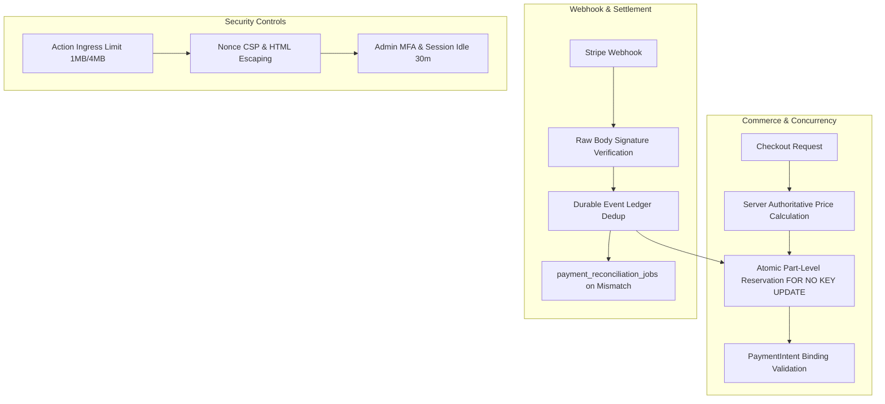

# South Aero — รายงานสรุปผลการตรวจสอบความพร้อมสำหรับ Production (Consolidated Audit & Readiness Report)

> **วันที่จัดทำ:** 7 ตุลาคม 2026 (Asia/Bangkok)  
> **กลุ่มเป้าหมาย:** ทีมพัฒนา (Dev Team), DevOps / Platform Engineer, และผู้ดูแลระบบ (System Owner)  
> **สถานะปัจจุบัน:** **CONDITIONAL GO-LIVE PREPARATION (รอการตั้งค่าสภาพแวดล้อม Production และ Provider จริง)**  
> *(Application Logic, Database Concurrency, และ Security Harness 477/477 ผ่านการทดสอบทั้งหมดแล้ว / รหัสผ่าน Neon ได้รับการ Rotate แล้ว)*

---

## 1. บทสรุปผู้บริหารและการอัปเดตล่าสุด (Executive Summary & Updates)

### 1.1 การอัปเดตล่าสุดด้านความปลอดภัย
* **[RESOLVED] การจัดการรหัสผ่าน Neon Database (SEC-01):**
  * **สถานะ:** **เปลี่ยนรหัสผ่านใหม่แล้ว (Rotated & Revoked)** ตามที่เจ้าของระบบยืนยัน
  * **ประเด็นเดิม:** พบการมี Credential literals ค้างอยู่ใน Git history 8 ไฟล์ (audit รอบ 14 ก.ย. 2026)
  * **การแก้ไข:** ในระดับซอร์สโค้ดได้นำ literals ออกและบังคับอ่านจาก Environment Variables เรียบร้อยแล้ว พร้อมทั้งทำการ Rotate/Revoke รหัสผ่านบนคอนโซล Neon เรียบร้อยแล้ว

### 1.2 สรุปผลความพร้อมของระบบ
* **Codebase & Concurrency:** ผ่านเกณฑ์ความปลอดภัยขั้นสูง จัดการ race condition ของสต็อก, ป้องกัน double-charge, ป้องกัน IDOR และปิดช่องโหว่การเงิน
* **Automated Security Harness:** ผลการรันชุดทดสอบ Adversarial Fuzzing/Security Gate ล่าสุด (**Run `security_test_88f9013e9fdf487da10381de05ce2697`**) ผ่านครบ **477 PASS / 0 FAIL / 0 BLOCKED / 0 UNIMPLEMENTED**
* **Build & Pages:** ผ่านการ Build แบบ Production ทั้ง Storefront และ Admin บน **Next.js 16.3.8** (React 19.1.9, ESLint 9 Flat Config) ตรวจสอบผ่านสมบูรณ์ทั้ง 50 Routes (Storefront 30 routes + Admin 20 routes)

---

## 2. เครื่องมือที่ใช้ในการทดสอบ (Testing Tools & Stack)

การตรวจสอบและทดสอบความปลอดภัยของ South Aero ดำเนินการผ่านเครื่องมือและกรอบการทดสอบเฉพาะทาง ดังนี้:

| เครื่องมือ / เทคโนโลยี | ขอบเขตและบทบาทในการทดสอบ |
| :--- | :--- |
| **`@repo/security-harness`** | Native Security Test Harness ที่พัฒนาขึ้นเฉพาะโปรเจกต์นี้ ใช้รันชุดทดสอบ 477 adversarial test cases จำลอง HTTP requests จริง, ทดสอบ boundary values, malformed inputs, Unicode, และ rate limits |
| **Playwright (Chromium / Edge)** | รัน headless browser ทดสอบ E2E flows, ตรวจสอบ Nonce-based CSP, DOM injection, Hydration errors, การทำงานของ Dynamic Scripts และตรวจสอบ Responsive Viewports (Mobile 390px, Desktop 1440px) |
| **Vitest (264 Unit/Integration Tests)** | รัน regression tests ในระดับ Workspaces (`admin`, `storefront`, `@repo/lib`, `@repo/ui`) ครอบคลุม DTO, Auth, Ingress, Monetary Arithmetic และ Zod Validation (Storefront 163 tests, Admin 101 tests ผ่าน 100%) |
| **PostgreSQL & Drizzle ORM** | ทดสอบการทำงานระดับ Transaction, Barrier Concurrency, Row-level Locks (`FOR NO KEY UPDATE`), Check Constraints และ Migration Reversibility บน Isolated Dynamic Schemas |
| **Stripe SDK & Mock Server** | ตรวจสอบการลงนาม Webhook ด้วย Cryptographic Raw Signature, ตรวจสอบ PaymentIntent binding, Idempotency keys และทดสอบการ Refund อัตโนมัติหลังรันเสร็จ |
| **Svix (Clerk Webhook Verifier)** | ตรวจสอบ Raw Headers/Payload Signature สำหรับการ sync บัญชีลูกค้า |
| **Localhost Resend Email Sink** | ดักจับ HTTP payload ของอีเมลใบเสร็จ/จัดส่ง ตรวจสอบการ escape HTML ป้องกัน Stored XSS โดยไม่ส่งอีเมลออกสู่ภายนอกจริง |
| **TypeScript (`tsc`) & ESLint** | ตรวจสอบ Strict Type Safety (`strict: true`) ทั้ง 8 workspaces และสแกน linting rules ด้วย ESLint 9 Flat Config (`eslint.config.mjs`) ไม่ให้มี syntax/runtime warning |
| **Gitleaks & Custom Secret Scanners** | สแกนหา Secret Patterns, API Keys, และ Credential Literals ในไฟล์โค้ดและ Artifacts |

---

## 3. ขอบเขตและสิ่งที่ได้รับการทดสอบอย่างละเอียด (What Was Tested)



### 3.1 ความถูกต้องด้านการเงินและคำสั่งซื้อ (Financial & Payment Integrity)
* **Server-Authoritative Arithmetic:** ราคาสินค้า, ภาษี, ค่าจัดส่ง คำนวณจาก Server ทั้งหมด Client ไม่สามารถส่งราคาเองได้ แปลงหน่วยสตางค์ด้วย BigInt (`toSmallestCurrencyUnit`) ขจัดปัญหา Floating Point precision loss (IEEE 754)
* **PaymentIntent Binding:** ตรวจสอบความถูกต้องของยอดเงิน, สกุลเงิน (Currency), โหมด (Live/Test) และผูก PaymentIntent เข้ากับ Order ID อย่างถาวร หากไม่ตรงกันระบบจะ Reject ทันที
* **Stripe Webhook Concurrency & Idempotency:**
  * ป้องกัน Webhook ยิงซ้ำ (Duplicate deliveries) ด้วย Event Ledger บันทึก `event_id` และเปลี่ยนสถานะแบบ Atomic
  * ป้องกัน Out-of-order event (เช่น `payment_failed` มาทีหลัง `payment_succeeded` จะไม่ย้อนสถานะ `paid` กลับไปเป็น `failed`)
  * ป้องกันการ Fulfill ซ้ำ (Double-fulfillment) แม้มี Webhook ต่าง ID ส่งมาพร้อมกัน
* **Reconciliation Queue:** กรณีที่ลูกค้าจ่ายเงินสำเร็จ แต่สต็อกหมดหรือเกิดข้อผิดพลาดในการ Fulfill ระบบจะบันทึกลงตาราง `payment_reconciliation_jobs` ในสถานะ `pending_review` เพื่อให้แอดมินตรวจสอบ ไม่ปล่อยให้สถานะค้างหรือตัดสต็อกมั่ว

### 3.2 ความถูกต้องของสต็อกสินค้าและ Concurrency (Inventory Atomicity)
* **ป้องกันการตัดสต็อกซ้ำซ้อน (STOCK-01):** แยก lifecycle ระหว่างการ "จอง" (Reservation) ตอน Checkout ออกจากการ "ตัดจำหน่ายจริง" (Consume) ตอนจ่ายเงินสำเร็จ ป้องกันการหักสต็อก 2 เด้ง
* **Simultaneous Checkout Race (STOCK-02):**
  * ทดสอบยิงคำสั่งซื้อพร้อมกันเพื่อแย่งชิ้นส่วนสุดท้าย (Last-item race) ผ่าน PostgreSQL Concurrency Barrier
  * ผลการทดสอบ: **มีเพียงออเดอร์เดียวที่ได้รับสินค้า ส่วนออเดอร์ที่เหลือได้รับ HTTP CONFLICT และสต็อกไม่ติดลบ**
* **Bundle Shared-Parts Atomicity:** ชิ้นส่วนรถยนต์ที่เป็น Bundle และใช้อะไหล่ร่วมกัน ได้รับการล็อกด้วย `FOR NO KEY UPDATE` ตามลำดับที่แน่นอน ป้องกัน Deadlock และป้องกันการขายเกินจำนวนอะไหล่จริง
* **Idempotent Restocking (ORDER-01):** การกดยกเลิกออเดอร์หลายครั้งติดต่อกันจะคืนสต็อกเข้าคลังเพียงครั้งเดียว ป้องกันสต็อกงอก

### 3.3 การพิสูจน์ตัวตนและการควบคุมสิทธิ์ (Auth & RBAC)
* **Customer Isolation (ป้องกัน IDOR):** ลูกค้า A ไม่สามารถเข้าถึงข้อมูลคำสั่งซื้อ, ที่อยู่ หรือประวัติของลูกค้า B ได้
* **Guest Token Security:** ระบบ Guest Checkout ใช้ Token ที่สร้างด้วย HMAC และมี Server-side TTL 7 วัน พร้อมผูกกับ HttpOnly, Secure, SameSite=Lax Cookie
* **Admin Privilege & MFA (MFA-01 / MFA-02):**
  * บังคับใช้ MFA (TOTP) สำหรับผู้ดูแลระบบ
  * การ Setup และ Confirm MFA ตรวจสอบค่า Hash และ OTP ที่ฝั่ง Server ป้องกันการ Hijack MFA
  * การ Disable MFA หรือการกระทำที่มีความเสี่ยงสูงต้องมีการ Re-authenticate ด้วยรหัสผ่าน
  * Session Idle Expiry กำหนดไว้ที่ 30 นาที และ Absolute Expiry ที่ 8 ชั่วโมง
* **ป้องกัน Staff ปลอมแปลงสถานะการเงิน:** บัญชี Staff ทั่วไปไม่สามารถกดเปลี่ยนสถานะออเดอร์เป็น `paid` หรือ `refunded` ผ่าน Admin UI Dropdown ได้

### 3.4 ความปลอดภัยของเบราว์เซอร์และการป้องกัน DoS (Browser & Ingress Security)
* **Action Ingress Guard:** ตรวจจับ Request Streamed Bytes จริงก่อนเข้าสู่ React Server Action Decoder
  * Request ปกติ (Non-multipart): จำกัดไม่เกิน 1,000,000 bytes (1 MB)
  * Multipart (Upload): จำกัดไม่เกิน 4 MB
  * หากเกินขนาด ระบบจะตอบกลับด้วย `HTTP 413 Payload Too Large` ทันที ป้องกันการโจมตี Buffer Exhaustion / DoS
* **Content Security Policy (CSP):**
  * ฝั่ง Admin ใช้ Nonce-based CSP ใน [apps/admin/lib/csp.ts](file:///c:/Users/thana/south_aero_project/southaeropart_project/apps/admin/lib/csp.ts)
  * บล็อกการทำงานของ Parser-inserted inline scripts และไม่อนุญาต `'unsafe-eval'` ใน production
* **Stored XSS Prevention:**
  * ข้อความรีวิวและข้อมูลลูกค้าได้รับการ Escape ก่อนแสดงผล
  * หน้า Email Preview และการส่งอีเมลใช้ iframe sandbox และ HTML escaping
  * ฟีเจอร์ **Customer Order Notes (T-16):** จำกัดขนาดข้อความ 2,048 UTF-8 bytes, ตรวจสอบ surrogate characters / control characters และมี Database Byte-length constraint กำกับ

---

## 4. ประวัติเอกสาร Audit ทั้งหมดในโปรเจกต์ (Audit Documentation Registry)

| วันที่ | เอกสาร | วัตถุประสงค์และผลลัพธ์ |
| :---: | :--- | :--- |
| **14/09/2026** | [production-readiness-report.md](file:///c:/Users/thana/south_aero_project/southaeropart_project/audit/2026-09-14/production-readiness-report.md) | **Initial Audit:** สรุป NO-GO พบ 25 กลุ่มข้อค้นพบ (Critical: Neon credentials ใน git, High: stock race, Next 14 EOL) |
| **15/09/2026** | [remediation-report.md](file:///c:/Users/thana/south_aero_project/southaeropart_project/audit/2026-09-14/remediation-report.md) | **Remediation Phase 1:** อัปเกรด Next.js 15, นำ Neon literals ออกจากโค้ด, แก้ไข Concurrency และ Unit Tests ผ่าน 178 ข้อ |
| **24/09/2026** | [predeploy-threat-model-2026-09-24.md](file:///c:/Users/thana/south_aero_project/southaeropart_project/docs/security/predeploy-threat-model-2026-09-24.md) | **Threat Model & Checklist:** วิเคราะห์ Trust Boundaries, STRIDE (17 หมวด) และ OWASP Top 10 / ASVS 5.0 L2 |
| **26/09/2026** | [SECURITY-HANDOFF.md](file:///c:/Users/thana/south_aero_project/southaeropart_project/SECURITY-HANDOFF.md) | **Security Harness Handoff:** ส่งต่องาน Security Runner บันทึก Baseline 153 PASS ขยายสู่กลุ่ม Guest/Product/Checkout/Webhook |
| **29/09/2026** | [full-security-continuation.md](file:///c:/Users/thana/south_aero_project/southaeropart_project/docs/security/handoff/2026-09-29/full-security-continuation.md) | **Full Native Matrix Run:** บันทึกผลทดสอบ 474 PASS / 3 BLOCKED (ติดเรื่อง Customer notes feature ที่ยังไม่ได้ทำ) |
| **29/09/2026** | [customer-notes-and-build.md](file:///c:/Users/thana/south_aero_project/southaeropart_project/docs/security/handoff/2026-09-29/customer-notes-and-build.md) | **Final Security & Site Verification:** เพิ่มฟีเจอร์ Order Notes + แก้ build error ส่งผลให้ได้ **477/477 PASS (Exit 0)** และ 37 routes ผ่าน |
| **30/09/2026** | [CLAUDE.md §5-§6](file:///c:/Users/thana/south_aero_project/southaeropart_project/CLAUDE.md#L191-L322) | **Project Master Standard:** บันทึก Security Requirements และ Release Gates อย่างเป็นทางการ |
| **07/10/2026** | Commit 798f761 | **Next.js 16 Upgrade:** อัปเกรด Next.js 16.3.8, ย้าย Linter สู่ ESLint 9 Flat Config, ตรวจสอบ Typecheck, Tests (264 ข้อ) และ Build 50 routes ผ่านสมบูรณ์ |

---

## 5. รายการสิ่งที่ทีม Dev และ DevOps ต้องทำก่อน Go-Live (Checklist for Dev & DevOps)

เพื่อให้ระบบพร้อมเปิดรับเงินจริงบน Production ให้ทีมงานดำเนินการตามขั้นตอนต่อไปนี้:

```markdown
### 1. Database & Migrations
- [x] Rotate / Revoke รหัสผ่าน Neon Database เดิมบน Neon Console (เสร็จเรียบร้อย)
- [ ] ทำ Snapshot / Backup ฐานข้อมูล Production
- [ ] ทดสอบ Restore Drill บน Branch หรือ Staging DB แยก
- [ ] ทำการรัน Migration `0004_payment_webhook_evidence.sql`, `0005_customer_order_note.sql` และ `0006_shipping_quotes.sql` บน Production Database

### 2. Provider Live Keys & Webhooks
- [ ] เปลี่ยนคีย์ Stripe จาก `sk_test_...` เป็น Live Secret Key (`sk_live_...`)
- [ ] ตั้งค่า Stripe Webhook Endpoint ชี้มายัง Production URL: `https://<domain>/api/webhooks/stripe`
- [ ] ตั้งค่า Clerk Authentication keys สำหรับ Production Domain
- [ ] ตั้งค่า Resend API Key และทำการ Verify DNS Domain (SPF/DKIM/DMARC) สำหรับการส่งอีเมลจริง
- [ ] ตรวจสอบ Cloudinary Credentials และ Folder/Quota บน Production

### 3. Background Workers & Schedulers
- [ ] ตั้งค่า Cron / Scheduler ภายนอก (เช่น Cloudflare Cron Triggers หรือ GitHub Action)
  - Endpoint: `POST https://<domain>/api/maintenance/orders`
  - Headers: `Authorization: Bearer <MAINTENANCE_SECRET>`
  - ความถี่: ทุก 1 นาที (เพื่อเคลียร์ reservation ที่หมดอายุ และ retry คิวอีเมล)

### 4. Hosting & Ingress Protection
- [ ] ตรวจสอบว่า Reverse Proxy (เช่น Cloudflare) ส่ง Headers `x-forwarded-for` อย่างถูกต้อง
- [ ] ตั้งค่า `TRUSTED_PROXY=cloudflare` ใน Production Environment
- [ ] ตั้งค่า WAF และ Edge Rate Limiter ป้องกันการโจมตีระดับเครือข่าย

### 5. Monitoring & Operational Alerting
- [ ] ตั้งระบบแจ้งเตือนเมื่อพบรายการในตาราง `payment_reconciliation_jobs` (ชำระเงินสำเร็จแต่สต็อกมีปัญหา)
- [ ] ตั้ง Alert เมื่อ Webhook ล้มเหลวต่อเนื่องเกินเกณฑ์
```

---

*เอกสารฉบับนี้ถูกรวบรวมจากประวัติการ Audit และโค้ดล่าสุด เพื่อใช้เป็นหลักฐานและคู่มือส่งมอบงานให้ทีมพัฒนาและผู้ดูแลระบบ*
