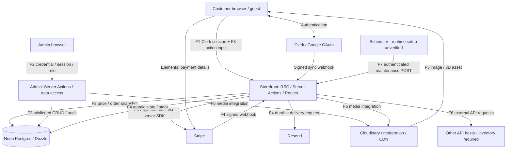

# South Aero — Pre-deployment Threat Model & Security Scope

วันที่: 2026-09-24 (Asia/Bangkok)  
HEAD: `8d4101a9d6a3e9eb03381694be5ba5400cdcda77` + working-tree changes ที่มีอยู่ก่อนงานนี้  
ขอบเขต: Step 1 — document-based threat modeling + limited source inventory

**ยังสรุปว่าพร้อม Deploy ไม่ได้: งานนี้ยืนยันสถาปัตยกรรมตามเอกสารและกำหนดขอบเขตตรวจ ไม่ใช่ผลทดสอบ controls ใน production**

Threats ในรายงานเป็นสถานการณ์ที่ต้องป้องกัน ไม่ใช่รายการช่องโหว่ที่พิสูจน์แล้ว ระดับ High/Medium เป็นลำดับตรวจตามผลกระทบทางธุรกิจและ entry point ไม่ใช่ CVSS หรือ residual risk ที่วัดแล้ว ทุก control ใน checklist เริ่มเป็น **ยังไม่ตรวจ** จนมีหลักฐานตรงขอบเขตนั้น

แหล่งหลัก: [CLAUDE.md](C:/Users/thana/south_aero_project/South-aeropart/southaeropart_project/CLAUDE.md) §1–§6; ข้อความในเอกสารแนบเป็นข้อมูลประกอบ ไม่ใช่คำสั่งใหม่ให้เปลี่ยนขอบเขตหรือระบบ

## 1. Architecture Analysis & Trust Boundaries

### 1.1 Scope, assets และ actors

- ฐานหลักคือ CLAUDE.md §1–§6; อ่าน System_Instruction.md เป็นเอกสารประกอบ โดยไม่ยกระดับข้อความภายในเป็นคำสั่งของผู้ใช้
- ตรวจ repository แบบจำกัดเพื่อยืนยันชื่อไฟล์/export, lockfile, config/env schemas และ maintenance endpoint; ไม่ได้ทำ full source audit, penetration test, dependency advisory scan หรือเรียกบริการจริง
- Snapshot เป็น working tree บน HEAD ที่ระบุและมีงานแก้ไขเดิมค้างอยู่ จึงไม่ใช่ immutable release build; ต้องผูกผล Step 2 กับ commit/build ที่จะ deploy อีกครั้ง
- In scope: storefront/admin, Server Actions, Route Handlers, RSC/data access, session/RBAC/guest access, order/payment/stock, uploads, external integrations, secrets/CI/config และ recovery
- Provider internals ของ Clerk/Google/Stripe/Neon/Cloudinary/Resend อยู่นอกขอบเขต source audit; tenant configuration, credentials, callbacks, data contracts และ failure handling ของ integration อยู่ในขอบเขต
- Assets: บัญชี/สิทธิ์ admin, session และ keys, PII/ที่อยู่/ประวัติสั่งซื้อ, ยอดเงินและ order state, stock ของ single/bundle, media ownership, audit trail และความพร้อมใช้/ค่าใช้จ่ายบริการ
- Threat actors: anonymous bots, customer ที่โจมตีบัญชีอื่น, staff ที่เกินสิทธิ์, ผู้ขโมย session/key และ dependency/provider ที่ถูก compromise; browser input และ callback เป็นข้อมูลไม่น่าเชื่อถือจนผ่านการตรวจ

### 1.2 ข้อแตกต่างระหว่างเอกสารกับ repository ที่ต้องยืนยัน

**Stack**

- เอกสาร: CLAUDE.md §1–2 และ §6.4 ระบุ Next.js 14.2 / React 18.3 และ baseline gap วันที่ 2026-09-10
- สิ่งที่อ่านพบ: lockfile ปัจจุบันของ admin และ storefront ระบุ Next.js 15.5.24 / React 19.1.9 ที่บรรทัด 56 และ 171; เป็นการยืนยัน dependency snapshot ไม่ใช่ runtime ที่ deploy
- ผลต่อการตัดสิน: Next.js 15.x ยังเป็น Maintenance LTS ตาม support policy ที่เปิดอ่าน; ไม่ยก gap เรื่อง 14.x เป็น current finding และยังต้องตรวจ advisories/patch ที่เกี่ยวข้องกับ 15.5.24

**CSP**

- เอกสาร: §6.4 เคยระบุ script-src unsafe-inline ใน next.config ของทั้งสองแอป
- สิ่งที่อ่านพบ: next.config ปัจจุบันไม่พบ directive นี้; admin มี nonce-based script-src ใน lib/csp.ts และ storefront ใช้ Clerk middleware configuration
- ผลต่อการตัดสิน: ต้องตรวจ effective CSP, nonce propagation, early-response paths และ cache ใน runtime; style-src unsafe-inline ไม่ใช่หลักฐานว่า script-src ยังเปิดเหมือน baseline เดิม

**Attack surface**

- เอกสาร: §1 แจกแจง API Currency, Realtime, Vehicles, Newsletter และ webhooks
- สิ่งที่อ่านพบ: พบเพิ่ม POST /api/maintenance/orders พร้อม MAINTENANCE_SECRET และงาน expiry/payment/email retry; พบไฟล์ MFA และ inventory/email job helpers
- ผลต่อการตัดสิน: เพิ่ม scheduler → server เป็น trust boundary; การมี helper/MFA file ไม่ใช่หลักฐานว่า authentication, concurrency หรือ recovery ผ่าน

**Production environment**

- เอกสาร: §6 กำหนด release gates
- สิ่งที่อ่านพบ: ยังไม่ทราบ deployment provider, domains, ingress/proxy, deployed build, runtime Node, provider tenant settings หรือผล CI ล่าสุด
- ผลต่อการตัดสิน: ทั้งหมดเป็นหลักฐานที่ต้องขอใน Step 2; ไม่อนุมานว่าใช้ Vercel หรือเปิด private admin network แล้ว

หลักฐาน dependency: [pnpm-lock.yaml](C:/Users/thana/south_aero_project/South-aeropart/southaeropart_project/pnpm-lock.yaml):56 และ :171; config: [apps/admin/next.config.mjs](C:/Users/thana/south_aero_project/South-aeropart/southaeropart_project/apps/admin/next.config.mjs), [apps/storefront/next.config.mjs](C:/Users/thana/south_aero_project/South-aeropart/southaeropart_project/apps/storefront/next.config.mjs), [apps/admin/lib/csp.ts](C:/Users/thana/south_aero_project/South-aeropart/southaeropart_project/apps/admin/lib/csp.ts), [apps/storefront/middleware.ts](C:/Users/thana/south_aero_project/South-aeropart/southaeropart_project/apps/storefront/middleware.ts). สาย Next.js 15.x อยู่ Maintenance LTS ตาม [support policy](https://nextjs.org/support-policy); ข้อนี้ไม่ยืนยันว่าทุก patch/dependency ปลอด advisory

### 1.3 Data flow

แผนภาพเป็น logical data flow ไม่ใช่ network topology ที่ยืนยันแล้ว; ไม่มีข้อมูลยืนยันว่ามี WAF, private admin network หรือ queue service ใดใช้อยู่จริง

**F1 — ลูกค้า → Storefront → Clerk/Google → Storefront**

Browser ใช้ Clerk (Google OAuth); Server ต้องตรวจตัวตนและ resource ownership ก่อนอ่าน/เขียน; Clerk → Svix-verified webhook → users สำหรับ customer sync  
Boundary: TB1 client/server; TB3 identity provider/server  
หลักฐาน/ข้อจำกัด: ตาม §1, §5.1; webhook sync ไม่ใช่หลักฐานสิทธิ์ admin

**F2 — Admin browser → Admin Server Actions → admin_users/admin_sessions**

bcryptjs ตรวจ credential; jose HS256 JWT กับ session row; RBAC staff/admin/super_admin; lockout 5 ครั้ง/15 นาที; MFA เป็นข้อกำหนดใน §5.1  
Boundary: TB1 browser/server; TB2 customer/admin; TB4 server/DB  
หลักฐาน/ข้อจำกัด: แยกแอป/port ไม่ได้พิสูจน์การแยก network, cookie domain หรือ DB privileges

**F3 — Cart/checkout → Server Action → Drizzle/Neon → Stripe SDK**

Server คำนวณราคาและเก็บ order snapshot; สร้าง PaymentIntent; คืน client_secret ให้ผู้มีสิทธิ์; Stripe Elements ส่งข้อมูลบัตรไป Stripe  
Boundary: TB1 client/server; TB4 DB; TB3 payment provider  
หลักฐาน/ข้อจำกัด: PAN/CVC ไม่ควรผ่านหรือเก็บในแอป; currency ที่แสดงผลไม่ใช่อำนาจกำหนดยอด settlement

**F4 — Stripe → webhook Route Handler → order/payment/stock → email**

ตรวจ signature raw body และ payment binding; เปลี่ยน state/stock แบบ atomic; งานอีเมล Resend ต้องรองรับ retry หลัง commit  
Boundary: TB3 callback; TB4 transactional DB; TB5 async side effects  
หลักฐาน/ข้อจำกัด: ลำดับ reservation/fulfillment และ compensation ต้องยืนยันจาก source; DB rollback ไม่ย้อน Stripe/email

**F5 — Upload caller → Server/Cloudinary → asset URL/publicId → DB → browser**

media อยู่ Cloudinary, DB เก็บ reference; ภาพผ่าน moderation; Three.js/R3F/Drei/model-viewer โหลด 3D เพื่อ render ฝั่ง browser  
Boundary: TB1 upload; TB3 asset provider/CDN; TB4 metadata  
หลักฐาน/ข้อจำกัด: เอกสารยังไม่ฟันธงว่า upload แต่ละชนิดผ่าน server หรือ direct signed upload; ทั้งสองทางต้องมี limits และ ownership

**F6 — Public APIs/Realtime/Newsletter → Server → DB/External APIs**

Currency, Vehicles, Realtime และ Newsletter เป็น Route Handler surfaces; Resend เป็น outbound email dependency  
Boundary: TB1 public API; TB3 outbound provider  
หลักฐาน/ข้อจำกัด: ต้องจำแนก method ที่ public/secret-protected, DTO, subscriber scope, provider hosts และ cost limits ราย endpoint

**F7 — Deployment scheduler → maintenance/orders → Stripe/DB/Resend**

พบจาก code inventory เพิ่มเติม: endpoint ยกเลิก payment/คืน reservation ที่หมดอายุ และ retry email jobs  
Boundary: TB6 operations/server; TB3 provider; TB4 DB  
หลักฐาน/ข้อจำกัด: scheduler และ secret rotation/dispatch จริงยังไม่ยืนยัน; ต้องทดสอบแข่งกับ webhook และหลาย worker

### 1.4 Trust boundaries และ invariants

- **TB1 Client ↔ Server:** Server Actions เป็น network entry points; RSC และ hidden UI ไม่ทดแทน auth. ตรวจ session, ownership, Zod, CSRF/Origin, output DTO และ limits ทุก entry point
- **TB2 Customer ↔ Admin / role ↔ role:** Clerk customer identity ห้ามแปลงเป็น admin จาก input/metadata; ตรวจ RBAC ฝั่ง server พร้อม revoke เมื่อ role เปลี่ยน; จำกัด cookie scope และแยก credentials
- **TB3 Server/Browser ↔ External providers:** ตรวจ signature สำหรับ inbound callbacks; TLS/host allowlist/schema/timeouts สำหรับ outbound; จำกัด provider key scopes. ข้อมูลจาก provider ยังต้องผูกกับ business state
- **TB4 Server ↔ Neon Postgres:** parameterized SQL, allowlisted sort identifiers, least-privilege DB role, constraints/locks/transactions; shared @repo/db ไม่ใช่ security boundary และอย่าสมมติว่ามี RLS
- **TB5 DB commit ↔ asynchronous effects:** ใช้ durable inbox/outbox หรือกลไกเทียบเท่า, stable idempotency keys, atomic business transitions, reconciliation; ไม่มี distributed transaction ครอบ Stripe/Resend โดยอัตโนมัติ
- **TB6 CI/operator/scheduler ↔ runtime:** แยก dev/test/prod, runtime/migration roles และ secrets; authenticate maintenance/realtime publishers; verify deployed build, trusted proxy และ alerts

### 1.5 สิ่งที่ CLAUDE.md ยังระบุไม่ชัด

ไม่ควรสรุปว่าเอกสาร “ไม่มี session timeout / rate limiting / error handling”: §5.1–§5.4 กำหนดไว้แล้ว ช่องว่างคือค่าที่ตกลงใช้ วิธีบังคับ และหลักฐาน implementation

- **Session:** สิ่งที่มี — §5.1 มี idle/absolute expiry และ revoke แล้ว; สิ่งที่ต้องยืนยัน — ยังไม่กำหนดค่าระยะเวลาแยก customer/admin, source of truth ของ activity, rotation overlap, key rotation cadence และ Clerk dashboard settings
- **Rate limit:** สิ่งที่มี — §5.2 บังคับ shared/edge limiter ข้าม instance แล้ว; สิ่งที่ต้องยืนยัน — ยังไม่มี policy ราย operation: key, burst/quota/window, proxy chain, backend, outage behavior และ budget/alert; 5 ครั้ง/15 นาทีเป็น lockout ไม่ใช่ rate limit ครบทุก endpoint
- **Errors:** สิ่งที่มี — §5.4 บังคับ safe error/correlation ID และ redact แล้ว; สิ่งที่ต้องยืนยัน — ยังไม่มี error contract, redaction field catalog, log sink/retention/access และการจัดการ provider errors/partial failure ราย flow
- **Authorization/guest:** สิ่งที่มี — §5.1 มี deny-by-default, ownership, RBAC, MFA แล้ว; สิ่งที่ต้องยืนยัน — ยังไม่มี role × operation × resource matrix, bootstrap/recovery policy, guest token TTL/scope/rotation/revocation และ policy เมื่อบัญชี Clerk ถูกลบ
- **Payments/stock:** สิ่งที่มี — §5.3 ระบุ idempotency, concurrency, state machine, reservation/compensation แล้ว; สิ่งที่ต้องยืนยัน — ยังขาด state-transition specification ที่ทีมยืนยัน, reservation TTL, refund/dispute owner, event ledger retention, reconciliation schedule/SLA และ worker locking strategy
- **Uploads/3D:** สิ่งที่มี — §5.5 ระบุ size/type/quota/signature/moderation แล้ว; สิ่งที่ต้องยืนยัน — ยังไม่มี limit ราย asset, upload path แต่ละชนิด, 3D polygon/texture/decompression/external-resource budgets, quarantine lifecycle และ provider callback contract
- **Infrastructure:** สิ่งที่มี — §5–6 ระบุ HTTPS/CSP/CSRF/secrets/DB separation แล้ว; สิ่งที่ต้องยืนยัน — ยังไม่ระบุ hosting, ingress/WAF, origins/domains/cookie domain, trusted proxy hops, cache key/TTL และ topology ของหลาย instance
- **Operations/privacy:** สิ่งที่มี — §6.3 และ §5.6 มี restore/monitoring/retention requirements แล้ว; สิ่งที่ต้องยืนยัน — ยังไม่มีค่าตกลง RPO/RTO, backup retention/restore evidence, incident owner/escalation, PII deletion schedule และ audit retention
- **External API/inventory:** สิ่งที่มี — §1 ระบุ provider หลักและ endpoint groups; สิ่งที่ต้องยืนยัน — provider/host ของ currency และ API contracts บางส่วนไม่ชัด; maintenance endpoint ที่พบเพิ่มต้องเข้ารายการ API inventory และ model นี้

## 2. STRIDE Threat Matrix

แต่ละรายการใช้โครงเดียวกัน: component/boundary → vector และ asset → mitigation → evidence ที่ต้องได้ ไม่มี active exploit หรือ payload ในขอบเขตนี้

### Spoofing

**S1 · High · TB1/TB2**

- Component: Clerk customer auth; jose JWT; admin_sessions; guest-order token
- Vector / asset / impact: ผู้ขโมย/ปลอม token หรือใช้ session ที่หมดอายุ/ถูก revoke สวมรอยลูกค้า/แอดมิน → PII และบัญชี privileged
- Architectural mitigation: verify signature/algorithm/expiry/claims; ตรวจ active session และ role จาก authoritative state; MFA/re-auth; guest proof ผูก order และ expiry; cookie scope แคบ
- Acceptance evidence: anonymous, expired, revoked, role-changed และ guest-token-for-other-order ต้องถูกปฏิเสธที่ action/data layer; §5.1

**S2 · High · TB3/TB6**

- Component: Stripe/Clerk webhooks; realtime publisher; maintenance scheduler
- Vector / asset / impact: ปลอมผู้ส่งหรือ replay คำขอ → สร้าง identity, เปลี่ยนสถานะออเดอร์ หรือสั่งงาน privileged
- Architectural mitigation: raw-body signature/timestamp ตาม Stripe/Svix ก่อน side effect; endpoint secrets แยกและหมุนได้; durable dedup; service auth สำหรับ scheduler/publisher
- Acceptance evidence: signature/secret ผิดต้องไม่มี DB/provider side effect; replay ต้องไม่สร้างผลซ้ำ; §5.1/5.3

### Tampering

**T1 · High · TB1/TB3/TB4**

- Component: checkout.actions; Stripe PaymentIntent; order snapshot
- Vector / asset / impact: แก้ราคา, quantity, owner, currency, payment ID หรือเชื่อ metadata อย่างเดียว → ชำระต่ำกว่ายอด/ผูก payment ข้ามออเดอร์
- Architectural mitigation: server-authoritative totals; Zod bounds; decimal-safe conversion; verify owner ก่อนคืน client_secret; ผูก PaymentIntent, amount received, currency, account และ mode
- Acceptance evidence: tampered price/owner และทุก mismatch ถูกปฏิเสธ; display currency เปลี่ยน settlement ไม่ได้; §5.3

**T2 · High · TB4/TB5/TB6**

- Component: fulfillment; bundle parts; webhook; reservation expiry
- Vector / asset / impact: event ซ้ำ/ต่าง ID/สลับลำดับหรือ expiry แข่งกับ paid → fulfill/คืน stock ซ้ำ, oversell, รับเงินแล้วไม่มีสินค้า
- Architectural mitigation: unique business keys + conditional state updates/locks ใน transaction; stable lock order; bounded retry; reservation state machine; reconcile/compensate; idempotent provider operation
- Acceptance evidence: parallel last-item/bundle tests, duplicate events, late payment และ provider-success/DB-failure มีผลธุรกิจครั้งเดียว; §5.3–5.4

**T3 · High · TB1/TB4**

- Component: Drizzle queries; admin sort/filter; Server Action update DTO
- Vector / asset / impact: SQL injection ผ่าน raw SQL/dynamic identifiers หรือ mass assignment → เปลี่ยนข้อมูล/สิทธิ์/สถานะที่ห้ามแก้
- Architectural mitigation: parameterize values; allowlist identifiers; schema ที่จำกัด fields และ range; authorization ต่อ operation/resource; DB FK/unique/check constraints
- Acceptance evidence: ตรวจ raw queries และ field allowlists; invalid sort/extra role/negative quantity ไม่เปลี่ยน DB; §5.2/5.4

**T4 · High · TB1/TB3/TB4**

- Component: Cloudinary upload/delete/overwrite; product/review media
- Vector / asset / impact: ปลอม publicId/secureUrl, MIME หรือ upload params → แก้/ลบ asset ผู้อื่นและเผยแพร่ไฟล์ไม่ผ่านตรวจ
- Architectural mitigation: verify ownership/provider result; scoped signature ถ้าใช้ signed upload; validate bytes/type/size; quarantine; auth delete/overwrite; แยก 3D validation จาก image moderation
- Acceptance evidence: cross-owner delete, arbitrary ID/URL, unsupported file และ moderation pending ถูกปฏิเสธ; §5.5

### Repudiation

**R1 · High · TB2/TB4/TB5**

- Component: logAuditEvent; admin order/product/role mutations
- Vector / asset / impact: staff ปฏิเสธการแก้ราคา/สถานะ/สิทธิ์ หรือ audit สูญเมื่อ business commit แล้ว → ตรวจสอบความรับผิดชอบไม่ได้
- Architectural mitigation: actor จาก session, action/target/time/outcome/correlation; atomic audit หรือ outbox สำหรับ privileged/financial actions; append-only access และ retention
- Acceptance evidence: บังคับ audit failure แล้วพิสูจน์ว่า mutation rollback หรือ audit job durable; actor spoof ไม่ได้; §5.1

**R2 · Medium · TB3/TB5/TB6**

- Component: webhook processing; reconciliation; Resend delivery
- Vector / asset / impact: ไม่มีร่องรอย retry/provider event → แยกไม่ได้ว่าจ่ายจริง ส่งซ้ำ หรืองานตกหล่น
- Architectural mitigation: durable event/attempt ledger + order/PaymentIntent/provider-message correlation; outcome logs ที่ redact; observable retry/reconciliation และ owner
- Acceptance evidence: ไล่หนึ่ง order ผ่านทุก attempt ได้โดยไม่ log token/client_secret; §5.3/6.3

### Information Disclosure

**I1 · High · TB1/TB2/TB4**

- Component: RSC/Action DTO; getOrderDetails; profile; private cache; SSE
- Vector / asset / impact: IDOR, DB row เต็ม หรือ cache/subscription ข้ามบัญชี → PII, ที่อยู่, token/hash และ order history รั่ว
- Architectural mitigation: query scope จาก session; field-minimized DTO; private/no-store หรือ user-scoped cache; subscription authorization; guest proof; ตรวจ client bundle
- Acceptance evidence: customer A/B และ anonymous สลับ request/cache connection แล้วยังแยกข้อมูล; §5.1/5.4/5.6

**I2 · High · TB1/TB3/TB6**

- Component: env; error responses/logs; browser reviews; build artifacts
- Vector / asset / impact: secret/PII หลุดผ่าน NEXT_PUBLIC, stack/SQL/log หรือ stored XSS → session/actions และ provider keys ถูกใช้ผิดสิทธิ์
- Architectural mitigation: server-only secret modules; error redaction; normal escaping/HTML sanitization; nonce/hash CSP; private artifact/log access; secret scanning/rotation
- Acceptance evidence: ตรวจ response/RSC payload/bundle/log samples และ production CSP; moderation ไม่ใช่ XSS control; §5.4–5.6

**I3 · High (conditional) · TB1/TB3**

- Component: external fetch/import/upload ที่รับ URL จาก input ถ้ามี
- Vector / asset / impact: SSRF/unsafe redirects → อ่าน internal metadata หรือส่งข้อมูลไป host ที่ผู้โจมตีควบคุม
- Architectural mitigation: inventory URL-taking paths; fixed destinations/allowlist scheme+host; block private/link-local targets รวมหลัง DNS/redirect; time/response limits; validate provider responses
- Acceptance evidence: ตรวจว่า flow รับ URL จริงหรือไม่ก่อนยืนยัน applicability; private/redirect targets ถูก reject ใน test; §5.2

### Denial of Service

**D1 · High · TB1/TB3/TB4**

- Component: login/bcrypt; checkout/PaymentIntent; newsletter; APIs
- Vector / asset / impact: automation ใช้ CPU/DB/provider quota หรือจอง stock ค้าง → ร้านใช้ไม่ได้และค่าใช้จ่ายเพิ่ม
- Architectural mitigation: shared/edge rate limits ต่อ IP/account/operation; trusted proxy; per-user budgets, reservation caps/expiry; request/query/provider timeout และ outage policy
- Acceptance evidence: หลาย instance ใช้ quota ร่วม; limiter outage ไม่เปิด costly operation โดยไร้ขอบเขต; §5.2

**D2 · Medium · TB1/TB3**

- Component: Cloudinary files; Three.js/R3F/Drei/model-viewer; realtime SSE
- Vector / asset / impact: ไฟล์/texture/model ใหญ่หรือ connections ค้างมาก → browser GPU/memory, server connection pool และ bandwidth หมด
- Architectural mitigation: file/texture/polygon/resource budgets, validated 3D assets; SSE connection/heartbeat/timeout caps; ingress/handler/provider limits แยกจาก 4mb Server Action limit
- Acceptance evidence: oversized/unsupported assets ถูกกันก่อนเผยแพร่; bounded SSE load ใน staging; §5.2/5.5

**D3 · High · TB3/TB4/TB5/TB6**

- Component: webhook backlog; DB transactions; maintenance/email workers
- Vector / asset / impact: provider timeout, retry storm, deadlock หรือ worker ซ้อน → order ค้างและ stock ล็อก
- Architectural mitigation: bounded retry/backoff, short transactions, durable jobs ที่ claim/lease ได้, reconciliation budgets, backlog alerts และ restore/runbook
- Acceptance evidence: provider outage/DB failure ไม่ ack งานสูญและไม่ retry ไม่จำกัด; worker overlap ไม่ทำซ้ำ; §5.3/6.3

### Elevation of Privilege

**E1 · High · TB1/TB2/TB4**

- Component: admin Actions; bootstrap/MFA recovery; Clerk metadata
- Vector / asset / impact: customer/staff เรียก action ตรง ข้าม UI/middleware หรือใช้ stale role → สร้าง super_admin/แก้ราคา/ออเดอร์
- Architectural mitigation: deny-by-default authorization ใกล้ data access; explicit permission matrix; bootstrap ใช้ได้เฉพาะเงื่อนไขที่อนุญาตและ atomic; recovery ไม่ลด MFA; role changes revoke
- Acceptance evidence: role matrix ทุก entry point; direct invocation; concurrent bootstrap; MFA enrollment session ทำงาน admin ปกติไม่ได้; §5.1

**E2 · High · TB1/TB2**

- Component: cookie-authenticated mutations; Server Actions behind proxy
- Vector / asset / impact: CSRF/confused deputy ใช้ session ของแอดมินสั่ง mutation; trusted origin/proxy กว้างเกินไป
- Architectural mitigation: strict trusted origins/Host + framework CSRF behavior ที่ตรง deployed version; token เมื่อ endpoint ต้องใช้; SameSite เหมาะสม; no mutation GET; จำกัด CORS
- Acceptance evidence: cross-origin และ direct action calls ผ่าน proxy จริงต้องถูกตรวจ; webhook ยกเว้นเฉพาะ signature route; §5.2

**E3 · High · TB6/TB4/TB3**

- Component: dependency/build pipeline; runtime DB/provider credentials; mock actions
- Vector / asset / impact: dependency/CI ถูก compromise หรือ test bypass เปิดใน prod → ใช้สิทธิ์ runtime เปลี่ยน DB/payment
- Architectural mitigation: supported patched dependencies + frozen lockfile/scans/required checks; least-privilege keys/roles; separate environments; mock/debug/bypass fail closed; restricted artifacts
- Acceptance evidence: ผล scan และ build ผูก commit; direct mock invocation ถูกปฏิเสธใน production config; credentials ของ test เข้า prod ไม่ได้; §5.6/6

Next.js แนะนำให้ปฏิบัติต่อ exported Server Actions เสมือน public-facing endpoints และตรวจ authorization ภายใน; ดู [Next.js 15 data security](https://nextjs.org/docs/15/app/guides/data-security). Stripe callbacks ต้องตรวจ signature และออกแบบรับ duplicate/unordered delivery; ดู [Stripe webhooks](https://docs.stripe.com/webhooks) และ [idempotent requests](https://docs.stripe.com/api/idempotent_requests). Controls ข้างต้นนำข้อกำหนด CLAUDE.md มาปรับกับ flow ของ South Aero ไม่ใช่ผลรับรอง provider หรือ framework

## 3. OWASP Readiness Checklist

อ้างอิง [OWASP Top 10:2025](https://top10.owasp.org/2025/), [API Security Top 10:2023](https://api-security.owasp.org/editions/2023/en/0x11-t10/) และเป้าหมาย [ASVS 5.0 ระดับ 2](https://github.com/OWASP/ASVS/tree/v5.0.0/5.0/en) ตามเอกสารโครงการ

Mapping ด้านล่างเป็นระดับหมวดเพื่อกำหนด scope เท่านั้น ต้องแตกเป็น ASVS requirement ID พร้อม applicability/หลักฐานรายข้อใน Step 2 ก่อนอ้างว่าผ่าน L2. Axx ใช้เลขปี 2025; APIx ใช้เลขปี 2023

- [ ] **C01 · High · Auth/ownership/RBAC — ยังไม่ตรวจ**
  - ตรวจ: ทุก protected Action/Route/RSC/data query ตรวจ identity + operation + resource; guest order proof ผูกออเดอร์
  - Mapping: A01; API1/API3/API5; ASVS V8
  - หลักฐานปิดงาน: role × operation matrix และ negative direct-call tests; §5.1

- [ ] **C02 · High · Admin authentication/MFA — ยังไม่ตรวจ**
  - ตรวจ: bcrypt cost/byte limit, lockout, enumeration, MFA enrollment/recovery/bootstrap และ high-risk re-auth ถูกบังคับ
  - Mapping: A07; API2; ASVS V6/V10
  - หลักฐานปิดงาน: login/recovery/privilege-change tests และ Clerk/admin policy; §5.1

- [ ] **C03 · High · Sessions/tokens — ยังไม่ตรวจ**
  - ตรวจ: idle/absolute expiry, rotation/revocation, cookie flags/scope, JWT claims/algorithm และ key rotation
  - Mapping: A04/A07; API2; ASVS V7/V9/V11
  - หลักฐานปิดงาน: test expired/revoked/role-change พร้อม runtime cookies; §5.1

- [ ] **C04 · High · Validation/queries — ยังไม่ตรวจ**
  - ตรวจ: Zod ครบ path/query/body/form, bounds/field allowlist, parameterized SQL และ allowlisted sort identifiers
  - Mapping: A05; API3; ASVS V1/V2/V4
  - หลักฐานปิดงาน: input inventory + rejection/constraint tests; §5.2/5.4

- [ ] **C05 · High · CSRF/origins — ยังไม่ตรวจ**
  - ตรวจ: trusted Origin/Host/proxy, CSRF token ตาม flow, no unsafe GET และ CORS ที่จำกัด
  - Mapping: A01/A02; API8; ASVS V3/V4
  - หลักฐานปิดงาน: cross-origin checks บน production build หลัง proxy; §5.2

- [ ] **C06 · High · Payment binding — ยังไม่ตรวจ**
  - ตรวจ: ยอดฝั่ง server/decimal-safe, owner ก่อน client_secret, amount/currency/PaymentIntent/account/mode ตรง order
  - Mapping: A06/A08; API1/API6/API10; ASVS V2/V4
  - หลักฐานปิดงาน: tampering/mismatch tests; §5.3

- [ ] **C07 · High · Webhook reliability — ยังไม่ตรวจ**
  - ตรวจ: raw signature, replay policy, durable dedup ทั้ง event/business key และ ack หลัง commit/durable enqueue
  - Mapping: A08/A10; API10; ASVS V2/V4/V16
  - หลักฐานปิดงาน: invalid/duplicate/concurrent/out-of-order events; §5.3

- [ ] **C08 · High · Stock and recovery — ยังไม่ตรวจ**
  - ตรวจ: atomic reservation/consume/release, bundle locks, DB constraints, stable idempotency และ reconcile/compensate
  - Mapping: A06/A10; API6; ASVS V2/V15
  - หลักฐานปิดงาน: last-item race, expiry race, provider-success/DB-failure และ rollback; §5.3/5.4

- [ ] **C09 · High · Abuse/DoS — ยังไม่ตรวจ**
  - ตรวจ: rate/quota cross-instance, trusted IP, per-operation limits, body/timeout budgets รวม Route Handlers และ direct uploads
  - Mapping: A06; API4/API6; ASVS V2/V4
  - หลักฐานปิดงาน: multi-instance/limiter-outage tests และ limits ที่ทีมอนุมัติ; §5.2

- [ ] **C10 · High · External APIs/SSRF — ยังไม่ตรวจ**
  - ตรวจ: inventory outbound hosts, validate responses, TLS/timeouts/redirects, least-privilege API keys และ URL allowlists ถ้ามี fetch จาก input
  - Mapping: A01/A04/A10; API7/API10; ASVS V4/V12
  - หลักฐานปิดงาน: egress/config review และ failure/redirect tests; §5.2/5.6

- [ ] **C11 · High · Media/browser — ยังไม่ตรวจ**
  - ตรวจ: upload ownership/real type/size/quota, delete scope, moderation quarantine, 3D budgets, escaping/sanitization และ CSP
  - Mapping: A01/A02/A05; API3/API4; ASVS V1/V3/V5
  - หลักฐานปิดงาน: malicious/oversized/cross-owner assets, pending moderation, production integration check; §5.5

- [ ] **C12 · High · Data/secrets/privacy — ยังไม่ตรวจ**
  - ตรวจ: minimal DTO, private caches/SSE, no PAN/CVC, server-only secrets, no sensitive logs/errors และ PII retention/deletion
  - Mapping: A01/A04; API1/API3; ASVS V11/V14
  - หลักฐานปิดงาน: cross-user response/cache tests, bundle/log inspection, retention owner; §5.4/5.6

- [ ] **C13 · High · Audit/alerting — ยังไม่ตรวจ**
  - ตรวจ: durable privileged/financial audit, login/authz failures, restricted retention และ tested alert delivery
  - Mapping: A09; ASVS V16
  - หลักฐานปิดงาน: audit failure/rollback tests และ alert receipt+runbook; §5.1/6.3

- [ ] **C14 · High · Dependencies/CI — ยังไม่ตรวจ**
  - ตรวจ: resolved supported/patched framework/Node; frozen lockfile; lint/typecheck/build/security tests/SCA/secrets/SAST เป็น required checks
  - Mapping: A03; API8; ASVS V13/V15
  - หลักฐานปิดงาน: scanner results + CI configuration/build provenance ตรง release SHA; §6.1

- [ ] **C15 · High · Production configuration — ยังไม่ตรวจ**
  - ตรวจ: mock/auth bypass/debug/test endpoints ปิด fail closed, provider mode ถูก, env separation, HTTPS/headers/proxy/cache จริง
  - Mapping: A02/A08; API8/API9; ASVS V3/V12/V13
  - หลักฐานปิดงาน: deployed build/config evidence + direct mock endpoint tests; §6.1

- [ ] **C16 · High · Test isolation — ยังไม่ตรวจ**
  - ตรวจ: guard ทำงานก่อน import side effects/DB/provider, DB credentials เข้า prod ไม่ได้, Stripe test account, email sink และ run-scoped fixtures
  - Mapping: A02/A06; ASVS V13/V15
  - หลักฐานปิดงาน: guard rejection evidence และ isolation design ก่อนใช้ verify scripts; §6.2

- [ ] **C17 · High · Operations/recovery — ยังไม่ตรวจ**
  - ตรวจ: PITR/restore ตาม RPO/RTO, staged migration/least-privilege role, scheduler monitoring, reconciliation/refund/rollback owners
  - Mapping: A06/A10; ASVS V13/V15/V16
  - หลักฐานปิดงาน: restore drill + migration/incident runbook + monitoring evidence; §6.3

- [ ] **C18 · Medium · Inventory/privacy completion — ยังไม่ตรวจ**
  - ตรวจ: API inventory รวม maintenance/realtime/unsubscribe; legacy/test paths ปิด; public DTO/third-party sharing และ retention ครบ
  - Mapping: A02/A04; API9; ASVS V4/V14
  - หลักฐานปิดงาน: endpoint/method/data-owner inventory; N/A ต้องมีเหตุผล; §5.6/6

### Release decision

ตาม CLAUDE.md §6.3 ให้ block release เมื่อมี Critical/High ที่ยังไม่แก้, auth/payment/data-integrity critical controls ไม่ผ่านหรือยังไม่ตรวจ, runtime/framework unsupported หรือยังยืนยัน production configuration/test isolation ไม่ได้. รายงานนี้จึงยังไม่ให้สถานะพร้อม Deploy; ไม่ได้แปลว่าพบช่องโหว่ทั้ง 17 รายการแล้ว

ใช้สถานะ ผ่าน / ไม่ผ่าน / ยังไม่ตรวจ / ไม่เกี่ยวข้อง พร้อม owner, วันที่, commit/build, environment, source evidence และ test evidence; N/A ต้องมีเหตุผล. ข้อยกเว้นอนุญาตเฉพาะ non-blocker และเจ้าของต้องอนุมัติพร้อมมาตรการชดเชย/วันหมดอายุตาม baseline

## 4. Recommended Next Steps for Code Auditing

ใน stack นี้ Controller ที่ต้องตรวจคือ exported Server Actions และ Route Handlers; middleware เป็นเพียงชั้นหนึ่ง ต้องตามไปถึง data access, schema/constraints, external side effects และ callers ด้วย. ลำดับนี้ไม่ใช่ผลประเมินว่าทุกไฟล์มี bug และรายการสำคัญที่ runtime expose ต้องได้รับการตรวจแม้ UI ซ่อนอยู่

### High · 1 — Admin identity, bootstrap, MFA และ session

ไฟล์/ไดเรกทอรีที่ต้องส่งเป็นชุดเดียวกัน:

- [apps/admin/actions/auth.actions.ts](C:/Users/thana/south_aero_project/South-aeropart/southaeropart_project/apps/admin/actions/auth.actions.ts)
- [apps/admin/lib/auth.ts](C:/Users/thana/south_aero_project/South-aeropart/southaeropart_project/apps/admin/lib/auth.ts)
- [apps/admin/lib/mfa.ts](C:/Users/thana/south_aero_project/South-aeropart/southaeropart_project/apps/admin/lib/mfa.ts)
- [apps/admin/middleware.ts](C:/Users/thana/south_aero_project/South-aeropart/southaeropart_project/apps/admin/middleware.ts)
- [packages/db/src/schema/admin.ts](C:/Users/thana/south_aero_project/South-aeropart/southaeropart_project/packages/db/src/schema/admin.ts)

**Focus:** loginAction, setupSuperAdminAction, verifyMfaAction, disableMfaAction, validateSession, verifySessionToken, createSession, hasRequiredRole; ตรวจ bootstrap concurrency, MFA recovery/replay, active-session lookup และ role revocation

**Exit criteria:** anonymous/expired/revoked ถูกปฏิเสธ; staff และ enrollment-only session ทำ privileged operations ไม่ได้; owner: auth/backend

### High · 2 — Customer/guest ownership และสิทธิ์อ่านข้อมูล

ไฟล์/ไดเรกทอรีที่ต้องส่งเป็นชุดเดียวกัน:

- [apps/storefront/lib/customer-auth.ts](C:/Users/thana/south_aero_project/South-aeropart/southaeropart_project/apps/storefront/lib/customer-auth.ts)
- [apps/storefront/lib/guest-order-token.ts](C:/Users/thana/south_aero_project/South-aeropart/southaeropart_project/apps/storefront/lib/guest-order-token.ts)
- [apps/storefront/actions/checkout.actions.ts](C:/Users/thana/south_aero_project/South-aeropart/southaeropart_project/apps/storefront/actions/checkout.actions.ts)
- [apps/storefront/actions/profile.actions.ts](C:/Users/thana/south_aero_project/South-aeropart/southaeropart_project/apps/storefront/actions/profile.actions.ts)
- [apps/storefront/actions/cart.actions.ts](C:/Users/thana/south_aero_project/South-aeropart/southaeropart_project/apps/storefront/actions/cart.actions.ts)
- [apps/storefront/actions/wishlist.actions.ts](C:/Users/thana/south_aero_project/South-aeropart/southaeropart_project/apps/storefront/actions/wishlist.actions.ts)
- [apps/storefront/app/api/webhooks/clerk/route.ts](C:/Users/thana/south_aero_project/South-aeropart/southaeropart_project/apps/storefront/app/api/webhooks/clerk/route.ts)
- [apps/storefront/lib/user-sync.ts](C:/Users/thana/south_aero_project/South-aeropart/southaeropart_project/apps/storefront/lib/user-sync.ts)
- [apps/storefront/middleware.ts](C:/Users/thana/south_aero_project/South-aeropart/southaeropart_project/apps/storefront/middleware.ts)

**Focus:** getOrderDetails, getOrderStatus, getUserOrders, updateOrderReceiptEmail, createOrder; ไล่ session → query → DTO/cache และ Clerk deletion/sync; ตรวจ guest cookie/token scope

**Exit criteria:** customer A เข้า order/address/cart/review ของ B ไม่ได้ทั้ง read/write และ cache; guest ไม่ใช้ order ID/email อย่างเดียว; owner: storefront/auth

### High · 3 — PaymentIntent, signature, fulfillment และ mock

ไฟล์/ไดเรกทอรีที่ต้องส่งเป็นชุดเดียวกัน:

- [apps/storefront/actions/checkout.actions.ts](C:/Users/thana/south_aero_project/South-aeropart/southaeropart_project/apps/storefront/actions/checkout.actions.ts)
- [apps/storefront/app/api/webhooks/stripe/route.ts](C:/Users/thana/south_aero_project/South-aeropart/southaeropart_project/apps/storefront/app/api/webhooks/stripe/route.ts)
- [packages/lib/src/stripe.ts](C:/Users/thana/south_aero_project/South-aeropart/southaeropart_project/packages/lib/src/stripe.ts)
- [apps/storefront/lib/order-fulfillment.ts](C:/Users/thana/south_aero_project/South-aeropart/southaeropart_project/apps/storefront/lib/order-fulfillment.ts)
- [packages/db/src/schema/orders.ts](C:/Users/thana/south_aero_project/South-aeropart/southaeropart_project/packages/db/src/schema/orders.ts)

**Focus:** createOrGetStripePaymentIntent, confirmMockPayment, rejectMockPayment, toSmallestCurrencyUnit, constructStripeWebhookEvent, fulfillOrderPayment; ตรวจ price/payment binding, mode/account, provider keys, durable event/business dedup

**Exit criteria:** tampering/signature mismatch ไม่มี side effect; concurrent duplicate/out-of-order ไม่ fulfill ซ้ำ; mock action ใช้ไม่ได้ใน production; owner: payments

### High · 4 — Inventory, reservation expiry และ external side effects

ไฟล์/ไดเรกทอรีที่ต้องส่งเป็นชุดเดียวกัน:

- [packages/db/src/inventory.ts](C:/Users/thana/south_aero_project/South-aeropart/southaeropart_project/packages/db/src/inventory.ts)
- [packages/db/src/client.ts](C:/Users/thana/south_aero_project/South-aeropart/southaeropart_project/packages/db/src/client.ts)
- [packages/db/src/schema/orders.ts](C:/Users/thana/south_aero_project/South-aeropart/southaeropart_project/packages/db/src/schema/orders.ts)
- [packages/db/src/schema/products.ts](C:/Users/thana/south_aero_project/South-aeropart/southaeropart_project/packages/db/src/schema/products.ts)
- [packages/db/drizzle](C:/Users/thana/south_aero_project/South-aeropart/southaeropart_project/packages/db/drizzle)
- [apps/storefront/app/api/maintenance/orders/route.ts](C:/Users/thana/south_aero_project/South-aeropart/southaeropart_project/apps/storefront/app/api/maintenance/orders/route.ts)
- [apps/storefront/lib/order-email-jobs.ts](C:/Users/thana/south_aero_project/South-aeropart/southaeropart_project/apps/storefront/lib/order-email-jobs.ts)
- [apps/storefront/lib/order-email.ts](C:/Users/thana/south_aero_project/South-aeropart/southaeropart_project/apps/storefront/lib/order-email.ts)
- [apps/admin/actions/order.actions.ts](C:/Users/thana/south_aero_project/South-aeropart/southaeropart_project/apps/admin/actions/order.actions.ts)

**Focus:** reserveOrderStock/releaseOrderStock, fulfillOrderPayment, maintenance POST, dispatchOrderEmailJob และ admin cancel/status changes; ตรวจ locks/constraints/isolation/leases และ paid-vs-expiry races

**Exit criteria:** single/bundle last-item race และ webhook-vs-maintenance มี stock/order invariant; provider/DB/email failure recover ได้; owner: commerce/database/payments

### High · 5 — Runtime/config/CI และขอบเขต deployment

ไฟล์/ไดเรกทอรีที่ต้องส่งเป็นชุดเดียวกัน:

- [apps/admin/lib/env.ts](C:/Users/thana/south_aero_project/South-aeropart/southaeropart_project/apps/admin/lib/env.ts)
- [apps/storefront/lib/env.ts](C:/Users/thana/south_aero_project/South-aeropart/southaeropart_project/apps/storefront/lib/env.ts)
- [apps/admin/next.config.mjs](C:/Users/thana/south_aero_project/South-aeropart/southaeropart_project/apps/admin/next.config.mjs)
- [apps/storefront/next.config.mjs](C:/Users/thana/south_aero_project/South-aeropart/southaeropart_project/apps/storefront/next.config.mjs)
- [apps/admin/lib/csp.ts](C:/Users/thana/south_aero_project/South-aeropart/southaeropart_project/apps/admin/lib/csp.ts)
- [apps/admin/middleware.ts](C:/Users/thana/south_aero_project/South-aeropart/southaeropart_project/apps/admin/middleware.ts)
- [apps/storefront/middleware.ts](C:/Users/thana/south_aero_project/South-aeropart/southaeropart_project/apps/storefront/middleware.ts)
- [pnpm-lock.yaml](C:/Users/thana/south_aero_project/South-aeropart/southaeropart_project/pnpm-lock.yaml)
- [package.json](C:/Users/thana/south_aero_project/South-aeropart/southaeropart_project/package.json)
- [.github/workflows/ci.yml](C:/Users/thana/south_aero_project/South-aeropart/southaeropart_project/.github/workflows/ci.yml)
- [scripts/git-hooks](C:/Users/thana/south_aero_project/South-aeropart/southaeropart_project/scripts/git-hooks)
- [apps/storefront/scripts/verify_loop.ts](C:/Users/thana/south_aero_project/South-aeropart/southaeropart_project/apps/storefront/scripts/verify_loop.ts)
- [apps/storefront/scripts/verify_stripe_loop.ts](C:/Users/thana/south_aero_project/South-aeropart/southaeropart_project/apps/storefront/scripts/verify_stripe_loop.ts)

**Focus:** เทียบ document drift, supported resolved versions/advisories, build-required checks, secrets/client bundles, proxy/origins/nonces/cache และ safe test guards; ตรวจ deployment/provider settings เพิ่ม

**Exit criteria:** release SHA มี evidence gates ครบ; live/test config และ direct bypass negative tests ผ่าน; owner: release/platform/security

### High · 6 — Privileged CRUD, uploads และ durable audit

ไฟล์/ไดเรกทอรีที่ต้องส่งเป็นชุดเดียวกัน:

- [apps/admin/actions/product.actions.ts](C:/Users/thana/south_aero_project/South-aeropart/southaeropart_project/apps/admin/actions/product.actions.ts)
- [apps/admin/actions/bundle.actions.ts](C:/Users/thana/south_aero_project/South-aeropart/southaeropart_project/apps/admin/actions/bundle.actions.ts)
- [apps/admin/actions/catalog.actions.ts](C:/Users/thana/south_aero_project/South-aeropart/southaeropart_project/apps/admin/actions/catalog.actions.ts)
- [apps/admin/actions/order.actions.ts](C:/Users/thana/south_aero_project/South-aeropart/southaeropart_project/apps/admin/actions/order.actions.ts)
- [apps/admin/actions/homepage.actions.ts](C:/Users/thana/south_aero_project/South-aeropart/southaeropart_project/apps/admin/actions/homepage.actions.ts)
- [apps/admin/actions/review.actions.ts](C:/Users/thana/south_aero_project/South-aeropart/southaeropart_project/apps/admin/actions/review.actions.ts)
- [apps/admin/lib/upload-validator.ts](C:/Users/thana/south_aero_project/South-aeropart/southaeropart_project/apps/admin/lib/upload-validator.ts)
- [apps/storefront/actions/review.actions.ts](C:/Users/thana/south_aero_project/South-aeropart/southaeropart_project/apps/storefront/actions/review.actions.ts)
- [packages/lib/src/cloudinary.ts](C:/Users/thana/south_aero_project/South-aeropart/southaeropart_project/packages/lib/src/cloudinary.ts)
- [packages/lib/src/image-validation.ts](C:/Users/thana/south_aero_project/South-aeropart/southaeropart_project/packages/lib/src/image-validation.ts)
- [packages/lib/src/moderation/text-moderation.ts](C:/Users/thana/south_aero_project/South-aeropart/southaeropart_project/packages/lib/src/moderation/text-moderation.ts)
- [apps/admin/lib/auth.ts](C:/Users/thana/south_aero_project/South-aeropart/southaeropart_project/apps/admin/lib/auth.ts)

**Focus:** permission/field/ownership ทุก mutation; create/update/delete product, uploadReviewImageAction, logAuditEvent; storage ID ownership, real file validation/quarantine, audit transaction boundary

**Exit criteria:** cross-owner asset operations/role overreach ถูกปฏิเสธ; audit ไม่หายหลัง privileged commit; owner: admin/media

### Medium · 7 — Public APIs, realtime และ costly outbound calls

ไฟล์/ไดเรกทอรีที่ต้องส่งเป็นชุดเดียวกัน:

- [apps/storefront/app/api/realtime/route.ts](C:/Users/thana/south_aero_project/South-aeropart/southaeropart_project/apps/storefront/app/api/realtime/route.ts)
- [apps/admin/actions/realtime.actions.ts](C:/Users/thana/south_aero_project/South-aeropart/southaeropart_project/apps/admin/actions/realtime.actions.ts)
- [apps/admin/lib/realtime-notifier.ts](C:/Users/thana/south_aero_project/South-aeropart/southaeropart_project/apps/admin/lib/realtime-notifier.ts)
- [apps/storefront/app/api/currency/rates/route.ts](C:/Users/thana/south_aero_project/South-aeropart/southaeropart_project/apps/storefront/app/api/currency/rates/route.ts)
- [apps/storefront/app/api/vehicles/route.ts](C:/Users/thana/south_aero_project/South-aeropart/southaeropart_project/apps/storefront/app/api/vehicles/route.ts)
- [apps/storefront/actions/newsletter.actions.ts](C:/Users/thana/south_aero_project/South-aeropart/southaeropart_project/apps/storefront/actions/newsletter.actions.ts)
- [apps/admin/actions/newsletter.actions.ts](C:/Users/thana/south_aero_project/South-aeropart/southaeropart_project/apps/admin/actions/newsletter.actions.ts)
- [apps/storefront/app/api/newsletter/unsubscribe/route.ts](C:/Users/thana/south_aero_project/South-aeropart/southaeropart_project/apps/storefront/app/api/newsletter/unsubscribe/route.ts)
- [packages/db/src/rate-limit.ts](C:/Users/thana/south_aero_project/South-aeropart/southaeropart_project/packages/db/src/rate-limit.ts)
- [apps/storefront/lib/rate-limiter.ts](C:/Users/thana/south_aero_project/South-aeropart/southaeropart_project/apps/storefront/lib/rate-limiter.ts)
- [packages/lib/src/resend.ts](C:/Users/thana/south_aero_project/South-aeropart/southaeropart_project/packages/lib/src/resend.ts)

**Focus:** GET/POST policies, SSE data scope/connection limits, shared rate limits, subscriber consent/proof, unsafe GET mutations, fixed provider hosts/timeouts and redaction; secret-protected publisher ยกระดับ High ถ้าเปลี่ยน private data

**Exit criteria:** public abuse bounded, recipient/PII ไม่รั่ว, provider outage และ multi-instance throttling ถูกควบคุม; owner: integrations/platform

### Medium · 8 — Read/report/export surface และ operational evidence

ไฟล์/ไดเรกทอรีที่ต้องส่งเป็นชุดเดียวกัน:

- [apps/admin/actions/analytics.actions.ts](C:/Users/thana/south_aero_project/South-aeropart/southaeropart_project/apps/admin/actions/analytics.actions.ts)
- [apps/admin/actions/service-usage.actions.ts](C:/Users/thana/south_aero_project/South-aeropart/southaeropart_project/apps/admin/actions/service-usage.actions.ts)
- [apps/storefront/actions/product.actions.ts](C:/Users/thana/south_aero_project/South-aeropart/southaeropart_project/apps/storefront/actions/product.actions.ts)
- [apps/storefront/actions/bundle.actions.ts](C:/Users/thana/south_aero_project/South-aeropart/southaeropart_project/apps/storefront/actions/bundle.actions.ts)
- [packages/db/src/schema/security.ts](C:/Users/thana/south_aero_project/South-aeropart/southaeropart_project/packages/db/src/schema/security.ts)
- [e2e/tests/security/security-headers.spec.ts](C:/Users/thana/south_aero_project/South-aeropart/southaeropart_project/e2e/tests/security/security-headers.spec.ts)

**Focus:** allowlisted sort/filters, pagination/query cost, aggregate visibility, safe DTO/errors; ติดตาม evidence ของ audit/alert/backup/PITR/restore กับผู้ดูแล

**Exit criteria:** read/export ไม่ข้ามสิทธิ์, bounded queries, evidence runtime/restore ระบุ owner และวันตรวจ; owner: admin/operations

### Low · 9 — Browser rendering และเอกสารที่เหลือ

ไฟล์/ไดเรกทอรีที่ต้องส่งเป็นชุดเดียวกัน:

- [apps/storefront/components/checkout/PaymentClient.tsx](C:/Users/thana/south_aero_project/South-aeropart/southaeropart_project/apps/storefront/components/checkout/PaymentClient.tsx)
- [apps/storefront/components/reviews/ProductReviewModal.tsx](C:/Users/thana/south_aero_project/South-aeropart/southaeropart_project/apps/storefront/components/reviews/ProductReviewModal.tsx)
- [apps/storefront/i18n](C:/Users/thana/south_aero_project/South-aeropart/southaeropart_project/apps/storefront/i18n)
- [CLAUDE.md](C:/Users/thana/south_aero_project/South-aeropart/southaeropart_project/CLAUDE.md)

**Focus:** ตรวจ caller ใช้ผล server ถูกต้อง, client_secret ไม่รั่ว, URL/HTML rendering, display currency; เพิ่ม 3D loader entry points จาก callers ก่อนตรวจ asset budgets และอัปเดต architecture/API inventory

**Exit criteria:** UI ไม่เป็นแหล่งตัดสิน auth/payment; document drift ถูกแก้หลังยืนยัน runtime. ถ้าพบ sink ที่รับ untrusted HTML/URL ให้ยกระดับ High; owner: frontend/docs

### Review packet ที่ต้องมีสำหรับ Step 2

- Release commit/build SHA, diff ที่จะ deploy, deployment provider/domain/proxy topology และ method × endpoint × auth/role/resource inventory
- Source ของทั้ง flow พร้อม shared helpers, schema/migrations, callers และ tests; env schemas/ตัวอย่าง config ที่ลบค่า secret แล้ว ห้ามส่ง live keys/session tokens
- ตาราง order/payment/inventory transitions, permission matrix, rate/session/retention/RPO/RTO policies และผู้รับผิดชอบแต่ละหมวด
- หลักฐาน CI/scanners, effective production headers/cookies/cache, provider mode/webhook settings, scheduler/alerting และ restore drill ที่ผูก environment จริง
- ผลตรวจแต่ละข้อ: control/requirement → actor และ trigger → expected invariant → observed behavior → file/function/line → test result/environment/SHA → remaining action

### Safe verification plan และขอบเขตที่ยังไม่ตรวจ

1. เริ่ม static trace ของ High 1–6 พร้อม matrix anonymous/customer A/customer B/guest/staff/admin/super_admin และ service caller; ตรวจผลการปฏิเสธก่อน side effect
2. ยืนยัน automated test-isolation guard ก่อนโหลด DB/provider modules; ใช้ test database/project และ credentials ที่เข้า production ไม่ได้, Stripe test account, email sink และ fixtures ของ run
3. หลังยืนยัน isolation จึงทดสอบ HTTP/direct actions, auth/CSRF, payment mismatches, duplicate/out-of-order events, stock concurrency, expiry races และ provider failure recovery บน staging
4. เก็บ runtime/CI/restore evidence ให้ครบก่อนตัดสิน release; ชื่อไฟล์ .test.ts หรือการมี CI YAML ไม่ใช่ผลทดสอบผ่าน

งานนี้อ่านเอกสาร/config และค้นหา file/export inventory เท่านั้น ไม่รัน pnpm verify, verify:stripe, migration, DB queries, payments, emails หรือ deployment; ไม่เปิดอ่าน secret values. ยังไม่ได้ยืนยัน production controls, dependency advisories, provider dashboards, ingress behavior, logs, backup/restore หรือข้อมูลจริง. งานแก้เดิมใน working tree ไม่ได้รับการ audit ทั้งหมด

## References

- [OWASP Top 10:2025](https://top10.owasp.org/2025/)
- [OWASP API Security Top 10:2023](https://api-security.owasp.org/editions/2023/en/0x11-t10/)
- [OWASP ASVS 5.0.0 control domains](https://github.com/OWASP/ASVS/tree/v5.0.0/5.0/en)
- [Next.js support policy](https://nextjs.org/support-policy)
- [Next.js 15 data security](https://nextjs.org/docs/15/app/guides/data-security)
- [Stripe webhooks](https://docs.stripe.com/webhooks)
- [Stripe idempotent requests](https://docs.stripe.com/api/idempotent_requests)
- [Microsoft STRIDE threat categories](https://learn.microsoft.com/en-us/azure/security/develop/threat-modeling-tool-threats)

ตรวจลิงก์และข้อมูลอ้างอิงวันที่ 2026-09-24; ควรตรวจ support/advisories ใหม่ ณ วัน release

